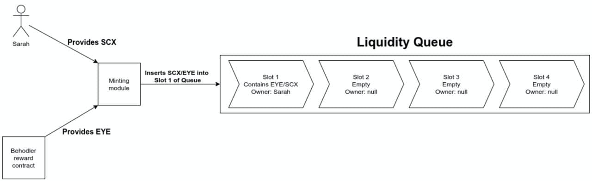
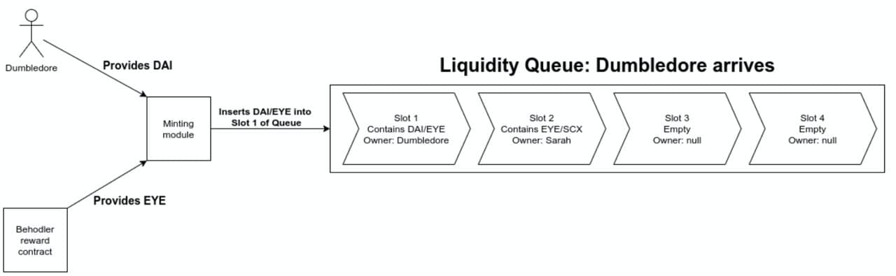
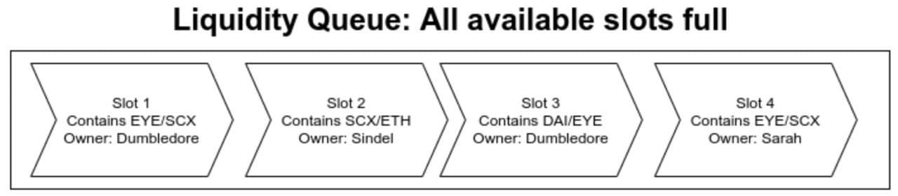
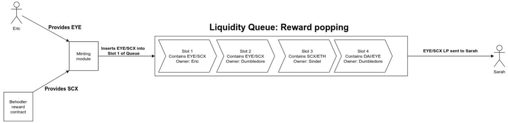

# Mining Liquidity with the Liquid Queue
by Justin Goro

# Introduction
We explore the problems with traditional liquidity mining in Ethereum and offer up an alternative, the Liquid Queue, to ameliorate these and provide a number of unexpected benefits. The first application of Liquid Queue will be on the <a href = "https://behodler.io">Behodler AMM</a> and the initial reference AMM will be <a href = "https://uniswap.org/">Uniswap</a>.

*keywords: liquid queue, liquidity, mining, diffusion, Ethereum, Uniswap, Behodler*

# Problems with traditional mining
## Sustainability
The main goal of any mining operation is to maximize the amount of liquidity tied up in the AMM. The most common method to achieve this is to provide a reward token to users on a daily or hourly basis in order to encourage them to leave their tokens staked in the mining pool. The drawback to this approach is that if the reward token comes from a fixed supply, the mining operation can only be temporary but if it's inflationary, the project is under pressure to provide a growing demand base for the reward token to act as a sink against the ever growing supply.

## Aggregate vs individual liquidity provision
A common misconcpetion of traditional mining is to conflate the benefit to the ecosystem from individual liquidity contributions with that of aggregate liquidity contributions. What matters isn't how long an individual stakes but how much aggregate liquidity is staked at any point in time, regardless of the coming and going of individuals. For instance, consider 2 fictional mining operations. Each draws in $1000 total liquidity over the course of a month. In the first operation, 10 people each provide $100 and are locked in for a month. The second operation has 10 people arriving every day, providing $100 each and then redeeming their staked liquidity later while another 10 file in after them. This sees 300 unique miners in the month. The net liquidity result is the same in both but in the latter, users experience a far quicker liquidity provision to reward turnaround. Not only is this more desirable from a UX perspective since no one is tied up for a month, it translates into a far higher APY.

## Demanding attention in an attention scarce economy.
An impediment to staking from an adoption point of view is expecting the user to remember that they have tokens locked in yet another dapp. It would be preferable if the mining dapp rewarded the user directly into their wallet passively without them having to execute an unstake or claim action later.

## Cryptoeconomic leverage
Here SushiSwap stands apart in developing vampire economics. Rather than just rewarding users to mine, Sushi managed to effect a massive liquidity transfer from one Dex to another by converting assets without losing value. For the most part though, mining operations have yet to leverage such forces as arbitrage dynamics to their full effect.

Liquid Queueing addresses all of the above concerns in one coherent set of smart contracts. This document will cover the necessary cryptoeconomic and technical aspects to explain how this is achieved.

# The end goal: mint Scarcity (SCX)
In Behodler, adding liquidity is signified by the minting of SCX. Our main goal is to effect as much SCX minting as possible. A secondary goal is to get SCX burning so that the liquidity remains in Behodler and so that we can send reward tokens back to the queue. A naive approach would be to simply pay people to mint SCX with a reward token. This would only achieve the primary goal. If we leverage the liquidity of other DEXes, we can achieve the secondary goal by enacting a number of feedback loops that drive sustainable queueing through arbitrage dynamics.

## Diffusion pricing
One approach to encouraging SCX minting is to raise the price of SCX on other DEXes. This would entice users into supplying liquidity as cheaply as they can to Behodler in order to mint SCX so that they can sell at a profit on the inflated DEX. We'll label the act of creating a temporary arbitrage opportunity in order to drive trading activity diffusion pricing as the imbalance is gradually corrected by opportunistic trading until the price reaches a settled level across the DEXes similar to hetereogenous fluids eventually settling into one uniform mixture through Brownian diffusion. Because Scarcity is a fee on transfer token, diffusion pricing has the added benefit of increasing SCX transfers and thereby returning reward tokens to the liquidity queue. Below we'll review a few diffusion pricing strategies and select the best one. In these examples we'll assume that the 'other' DEX is Uniswap for simplicity.

1. **Buying SCX with EYE on Uniswap.** Here we simply use the mining reward pool of EYE to temporarily purchase SCX on Uniswap in order to drive up the price. Profit motivated traders will then mint SCX on Behodler and sell for EYE on Uniswap. Using this strategy, we find 3 constraints on traders seeking to restore balance. For a given price differential, higher gas prices exclude smaller buyers. In order to effect a large sample of trading beyond whales, the price movement has to be significant. However, effecting a significant price movement may spark a panic sell off of EYE which would unfairly punish holders of EYE. This strategy is also constrained by the total liquidity pooled on Uniswap because it does nothing to boost the liquidity beyond an uptick in levying of the 0.3% fee.

2. **Airdropping EYE on EYE/SCX LP holders.** An improvement over the previous strategy, airdropping would deepen the liquidity on Uniswap and would drive users into minting SCX in order to pair with EYE. The main challenges in this scenario is the expense of managing a large base of holders and in creating incentives for the holders to not unwind their LP after every airdrop.

3. **Price tilting.** Here we utilize the LP minting dynamics to both increase liquidity while bending the price in favour of SCX. Uniswap pairs keep track of the balance of the two constituent tokens. If the actual true balance is higher than the recorded balance, anyone can invoke the mint function. This updates the recorded balances to reflect the actual balance and issues LP tokens to the caller in proportion to the increase in liquidity. Suppose a pair exists for two tokens, T1 and T2. We initialize this pair by sending 100 units of T1 and 100 units of T2 to the pair and mint LP tokens. If we request a quote for a swap later, we'll note that the price of T1 and T2 are equal to one another at the margin. If instead we send 50 units of T1 and 100 units of T2 and mint, the price of T1 in terms of T2 will be higher. Price tilting through mining involves matching a user input token with a corresponding token to mint LP in a pair of the 2 tokens but in a ratio that tilts the price in favour of one. Here we'd offer slightly more EYE than the market price implies to the user's SCX so that on minting, the price tilts in the direction of SCX.
Tilting benefits from both increasing the liquidity depth of the EYE/SCX market on Uniswap while creating an incentive for Behodler users to mint SCX. If we mine to 2 LPs with a common token, such as EYE/ETH and EYE/SCX with price tilting in favour of EYE in the former and SCX in the latter, then we create an ongoing arbitrage market for bots on Uniswap which increases burning and fee revenue for queuing, the net result of which is an ever increasing pool of liquidity on Behodler and on Uniswap. For these reasons, we select price tilting as the optimal mining strategy.

## Criticisms of diffusion pricing in general and price tilting in particular.
It should be noted that when levying criticisms against a particular mining paradigm in a vacuum, one should also compare the mining operation to all other mining operations. If the criticism is a common drawback across all operations, it may just be endemic to mining rather than a particular flaw to the dapp in question. Nonetheless there are some with diffusion pricing which this section identifies and attempts to address.

1. **If price tilting pushes up the price of SCX relative to EYE, does that mean the dollar price of EYE will fall?** If you take a standard, high liquidity token such as WETH or Dai and price tilt EYE against that, then when SCX is price tilted against EYE, the observed effect is an increase in the price of both tokens. It should be noted that the price of SCX is deterministic based on what it can redeem. If the SCX price is tilted, the imbalance will be calculable and the net effect will make SCX appear to trade at a premium. Arbitrage traders will be able to spot the premium unambiguously.

2. **Will arbitrage traders not simply undo the entire process and take prices and liquidity back to their levels before diffusion pricing techniques were employed?** Suppose a miner receives a Uniswap LP at a discount by supplying EYE and having it wrapped with SCX given from a Reward Contract maintained by Behodler in such a ratio that the SCX price is tilted upwards. They then immediately unwrap their LP upon receiving it and sell the components, undoing the benefit to the system. It should be noted that whenever Scarcity is involved, the net result is never a return to baseline because every transfer involves some burning. So in the case of unwrapping and selling, if they sell on Uniswap, there are 2 transfers taking place with 2 corresponding burns. This leaves Behodler with a small net gain in liquidity. If the liquidity is first locked up in some way for a certain period to prevent unwinding, then traders will first exploit arbitrage price differences, leading to an increase in liquidity on Behodler and some Scarcity transfers. In this case, if the miner unwinds their LP, the Scarcity contained within would have gone through at least 3 burns. In addition the arbitrage traders would have reduced the incentive to immediately sell the SCX locked in the LP as the Uniswap price would likely have drifted back toward the true value. If we add liquidity pools for both tokens denominated in well known and highly liquid currencies then we provide Uniswap arbitrage bots, who know nothing about Behodler, with a means to act on short term price drift. For instance, adding SCX/ETH as well as EYE/WBTC would create price correction opportunities whenever ETH and WBTC diverge. This correction would lead to SCX burning which would then create an imbalance in the EYE/SCX LP which would lead to secondary opportunities on EYE/SCX, leading to yet more SCX burning. For each additional independent token paired with SCX on uniswap, the consequent burning from random price walk increases. Finally, it may be worth exacting a friction fee on the LP minted. Since the miner is effectively getting up to 100% return on their provided liquidity, a 10% fee which is permanently locked in a contract, may be sufficient to effect a permanent gain in liquidity.

# The Liquidity Queue explained

The purpose of the Liquidity Queue is to achieve the following goals:

1. Sustainable and permanent liquidity mining.
2. Net gain in aggregate locked liquidity for Behodler which is increasingly impervious to counter vampire-like drains.
3. An improved UX for those who don't wish to expand their list of tokens that must be unstaked in the future.
4. Feedback loops that automatically increase incentives to provide liquidity when demand to queue declines and that take advantage of spikes in demand.

Since the SCX fees are used to fund the sustainability of the Liquidity Queue, there needs to be a bridging phase during which SCX fees are low. EYE will be used in this bridging phase to offer rewards to users to make up for SCX shortfalls. As liquidity provision increases and arbitrage trading of SCX occurs on an increasing number of LPs and DEXes, the use of EYE as a reward token will be phased out. At this point, EYE will only remain as an input token.

## Phase 1: EYE on the Prize
During phase 1, three liquidity pools on Uniswap will be offered to reward liquidity to users who mine. To participate, a user provides one of 4 tokens: Dai, Eth, SCX or EYE. Each is paired with a corresponding token and used to mint a Uniswap LP. The 3 LP tokens respectively are EYE/DAI, SCX/ETH, and EYE/SCX. Supplying either SCX or EYE leads to the creation of EYE/SCX. Price tilting is employed to effect primarily an increase in the value of SCX on Uniswap. However, in order to signal to trading bots and the market in general that EYE hasn't fallen in value, price tilting in favour of EYE is also enacted. This creates the effect of increasing the price of EYE relative to popular and liquid tokens and then increasing the price of SCX relative to EYE which gives SCX an additional boost over DAI and ETH.

### Tilting
To be precise in our use of language, when we say SCX is tilted, we are using shorthand to say that we mint LP out of SCX and a second token in a ratio that implies a higher price for SCX than is currently recorded by that LP. The following table illustrates the reward LP token in the middle column and the direction of tilting

<table>
<tr>
    <th>Input Token</th><th>LP Reward</th><th>Tilted Token</th>
</tr>
<tr>
    <td>DAI</td><td>EYE/DAI</td><td>EYE</td>
</tr>
<tr>
    <td>ETH</td><td>SCX/ETH</td><td>SCX</td>
</tr>
<tr>
    <td>SCX</td><td>EYE/SCX</td><td>SCX</td>
</tr>
<tr>
    <td>EYE</td><td>EYE/SCX</td><td>SCX</td>
</tr>
</table>

The above setup ensures that EYE is being unambiguously tilted in the most popular unit of account, the US dollar. This ensures that SCX tilting is not at the expense of EYE. For the instances where ETH or EYE is provided by the miner, this is subject to the availability of SCX from fee revenue.

This set of LPs represents the minimum viable set necessary to create ongoing inter-Uniswap arbitrage opportunities for SCX, increasing burning and thereby simultaneously achieving the goal of increasing locked up aggregate liquidity in Behodler while providing a growing source of revenue for phases on queueing where EYE is no longer offered as a reward.

### Reward Contract
There will be a queue treasury known as the Reward Contract which will be prepopulated with a large quantity of EYE. SCX charges a fee on transfer. Part of that is burnt. But another part is sent to the Reward Contract to reward users supplying EYE as an input token. In time, as SCX burn increases, it is expected to predominate as the main reward so that when EYE depletes, SCX will be the sole reward token.

### Queue
In contrast to mining operations that require a stake-and-wait approach, Liquidity Queue offers LP on a first in, first out (FIFO) queue. The queue has a certain number of slots and the initial condition is that all slots are empty. When the first user offers up an input token, the corresponding LP produced is inserted into the first slot. In the diagram below, we see the situation where an empty queue has been populated with just one batch of LP.

The Reward Contract contains the total EYE reward available for queueing as well as any accumulated SCX revenue. Here Sarah supplies SCX. The Reward Contract supplies EYE which the minting module wraps into LP. The minting module then inserts LP into the first slot in the queue. Following this, Dumbledore offers up Dai in the hopes of receiving EYE/DAI LP.

Once again, the Reward Contract supplies EYE at a ratio determined by the Uniswap price. Note that Sarah has now advanced closer to the end of the queue. Dumbledore's arrival has pushed her along. This insertion-displacement is the core feature of how the queue advances.

In the next diagram, 2 more arrivals have filled the 4 slots of the queue. Take note that Dumbledore owns 2 batches in the queue. There is no upper limit to how many slots a single address can occupy, aside from the total length of the queue. As we shall see below, allowing multiple slots to be occupied by 1 wallet address is a key part of the cryptoeconomic dynamics inherent to liquidity queueing.

When the next user arrives, Sarah's LP is popped off the queue and sent to her wallet. There is no need for her to return to claim her LP. Note that this reward popping action happens in the same transaction as the arrival of Eric's LP.

This concludes the simplest implementation of the Liquid Queue that achieves the desired properties.

## Implications
The time an LP batch spends in the queue is proportional to the popularity of the queue. The only upper limit to the velocity of the queue is the gas block constraints and the network speed. Theoretically, a user could purchase LP and have their batch pushed out in the span of one block. While the return on investment (ROI) is more or less constant, the faster the queue moves, the higher the implied annual percentage yield (APY). This should act as an incentive to marginal users, further accelerating the queue, creating a positive feedback loop. Similarly, if the popularity of the queue wanes, the speed declines until, at the extreme, it halts. Since diffusion pricing creates an arbitrage opportunity for traders of SCX on Uniswap, if the queue clears too quickly, the LP holder could unwind their LP and reduce the liquidity depth of possible arbitrage trades before external traders have had a chance to act on the price tilting. When this happens, the net loss to the system is reflected in EYE or SCX handed out by the Reward Contract. So there exists an optimal queue velocity such that the LP is locked long enough for traders to mint SCX on Behodler and sell on Uniswap on the one hand but not locked too long that the queue becomes undesirably slow for new entrants.

## Optimizing the Queue
We've identified two positive feedback loops in queue velocity: popularity leads to unchecked acceleration and unpopularity collapses down to a locked queue. We've also identified that there is some optimal velocity such that the queue is considered rewarding enough to induce new entries but not so rewarding that arbitrage traders are unable to take advantage of diffusion pricing. It should also be noted from a security standpoint that the queue should not be allowed to clear a batch in the span of one block. This opens it up to complex compositional attack vectors involving flash loans. Anticipating such attacks is fraught with risk. This section identifies two negative feedback loops that can be brought to bear which would help optimize the queue velocity while also increasing aggregate liquidity retained. Arbitrage trading will only happen if the degree of price tilting is high enough. However, the higher the price is tilted, the lower the ROI. To see why, consider a user who sends in ETH in order to purchase ETH/SCX LP. If we wish to tilt the price of SCX, we need to supply a higher value of ETH to the LP than SCX. So immediately we have to offer a less than 100% ROI. The lower we set the ROI, the more the price tilts. However, this reduces the primary incentive to queue. So here too, we have a variable to optimize.

### Price tilt ratio
Suppose that in order to enter the queue, a user mints SCX on Behodler. There will exist a period whereby the minting of SCX on Behodler raises the price on Behodler relative to Uniswap. The duration of this period and the extent of the price divergence depends on a number of factors but for argument sake, suppose this increase in price is 10% and that the price tilt causes the price on Uniswap to rise by 10%. The net effect will be to instantly close arbitrage opportunities, negating the secondary effects brought to bear by external traders. It should be noted, however, that an absence of arbitrage opportunities still leaves Behodler with a net gain of liquidity. So we can see that in the worst case, price tilting must perfectly offset the impact on price through minting on Behodler. Of course some users will add SCX that hasn't been recently minted. So there is no way to algorithmically set price tilting to an optimal level. Instead it should be calibrated based on trading and queueing data collected through live use.

### Dynamic LP burn
The minimum return on investment is 0. This is where a user supplies an input token and receives no corresponding token in which to mint LP. The maximum ROI is bounded by the optimal price tilting strategy. In reality, gas costs require the supplied reward to be greater than zero in order to break even. Since the queue can be replayed by unwinding the LP at the end and resupplying, many users will consider the APY to be of more relevance than the ROI. A high queue velocity dramatically affects the APY. For instance, suppose the return on investment is 1%. If this is realized over the course of 6 hours, the implied APY is over 2 million percent. While there are many limiting factors that would preclude the realization of 2 million percent over the course of a year, a user in this case could still walk away with a large profit in a short period if the queue is moving quickly. As noted, this risks undermining the purpose of diffusion pricing by preventing traders from acting on temporary price differentials. For this reason, it is reasonable to exact a fee on the newly minted LP which is then sent into a black hole contract, never to be retrieved. This mechanism would have the effect of increasing the flow of permanently locked LP when queue popularity increases. We'll refer to this mechanism as LP burn but do note that this is distinct from the actual burn functionality on Uniswap LP. Here burn is shorthand for "permanently lock tokens". If LP burn is a constant percentage then there is not much additional incentive for the queue to slow down to optimal levels when it is popular. For this reason, the LP burn percentage should be dynamic and increase during spikes in popularity and drop off to zero during lull periods. It is necessary then to measure queue velocity in order to algorithmically adjust burn percentage. Bear in mind that even though a higher LP burn percentage may reduce the ROI, it can be set in such a way that the implied APY still increases dramatically during peaks in popularity. LP burn has the effect of permanently increasing the depth of the Uniswap market, thereby eventually attracting bot trading which is necessary for ongoing SCX burning.

### Velocity Collapse
At the other extreme, queue unpopularity may lead to a situation where the queue no longer moves and as a result, no one wishes to join in the event that the queue doesn't move. Here a secondary reward mechanism should kick in after a certain timeout, rewards per hour for staking. The reward need not be proportional to value staked. Instead it is created to entice marginal users to enter simply to earn staking hourly rewards. Once enough marginal users enter the queue in order to receive hourly rewards, the queue will naturally begin to move, at which point the hourly rewards may cease. In the first phase of queueing, the reward will be paid from EYE set aside for mining. However, as SCX trading rises, SCX can take over at some point. The value of the reward has to be enough to draw users away from competing mining operations outside of Behodler. However, the user is also receiving an ROI through LP creation so the competitiveness of the hourly reward need not be on par with other mining operations. Nonetheless, the number will need to be calibrated in order to prevent stagnation.

# Rollout
In order to correctly calibrate queueing, it will need to be tested. Since profit seeking and loss aversion are of biggest interest, testnet tests are of limited usefulness and serve only to identify and eliminate bugs. Testnets also lack a well developed Uniswap market. For this reason, we require test users to have skin in the game and to have access to Mainnet Uniswap. We've determined that a closed beta release should be rolled out and details will be released shortly. In this instance, all global variables such as the rate of dynamic locking adjustment and the stagnant queue reward should be open to calibration. Once enough data has been collected, we can open the queue to the general public.

## Future phases
It should be noted that the more liquid LPs that contain SCX there are the better for overall SCX burn. As such the end game for queueing is to have an LP for every token on Behodler. In addition, to have mirrored LPs on Sushiswap and then to expand to the other DEXes. Essentially Liquidity Queueing will creep into all corners of the Ethereum AMM space. From there we may send SCX via wrappers to various layer 2 solutions in order to engage in high speed trading and thereby bringing a new level of SCX fee revenue back to the liquidity mining operation on Mainnet. Liquidity Queueing won't simply increase the depth of Behodler's pools, it will secure Behodler as a Mainnet anchor by subsidizing gas expenditure through fee revenue earned on layer 2. In time it is hoped that Behodler will become a central clearinghouse for the entire ERC20 market on Ethereum.

 